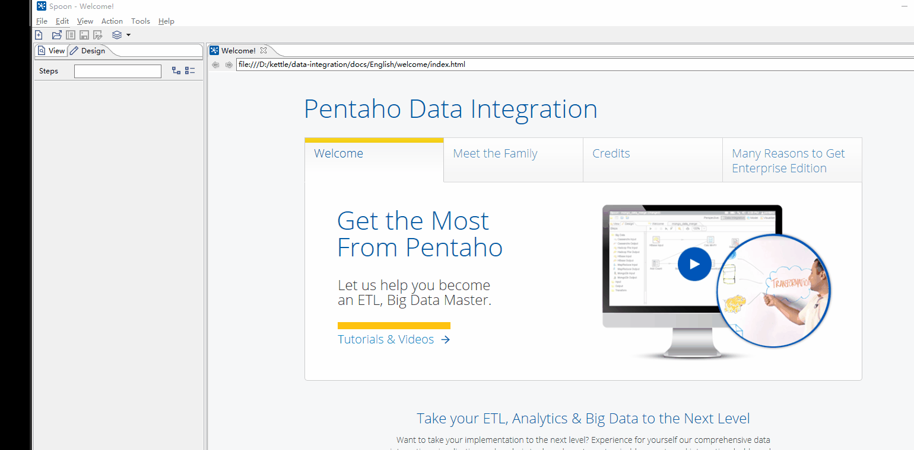
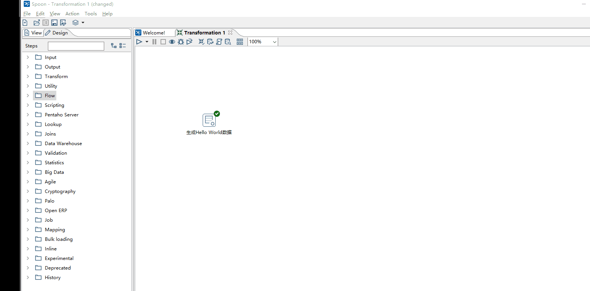
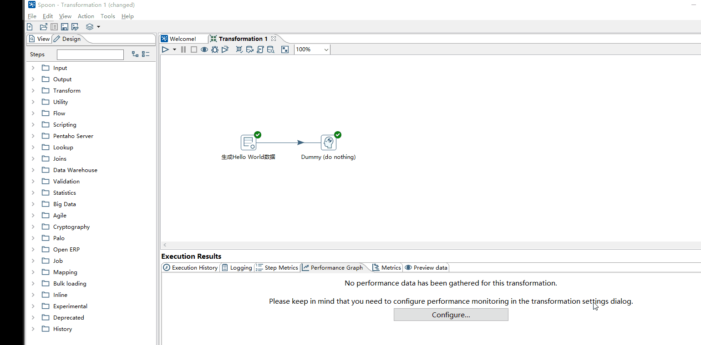
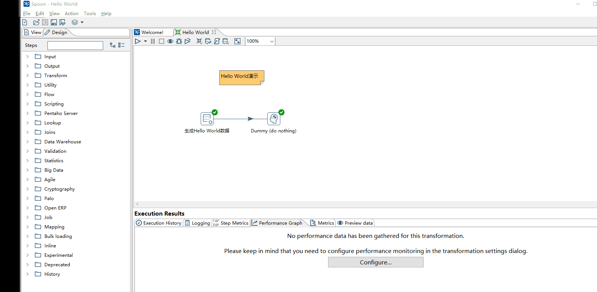

## 下载，使用Kettle

* 下载地址: https://sourceforge.net/projects/pentaho/files/Data%20Integration/

* 必备条件：安装了Java环境，并配置了路径；将从Kettle压缩包解压后即可用

* 打开方式： 针对Windows系统，在调用 Spoon.bat ; 在Linux系统上，调用 Spoon.sh
  
* Kettle是什么 ：Java编写的开源ETL工具

## Hello World 

通过制作一个Hello World例子，进行对Kettle的操作流程说明，认识Kettle处理中的整体过程。

* 创建一个Transformation : File --> New --> Transformation 
* 使用Generate Rows Step: Design --> Input --> Generate Rows
* 设置Generate Rows Step：左键双击或右键点击在窗口中选择Edit；进行命名和设置要输出的信息

* 使用Dummy Step : Design --> Flow --> Dummy 
* 设置Dummy Step ：通过Hop连接 Generate Rows Step 和 Dummy Step ; 认识Step的工具栏 ; 预览查看 ; 查看执行信息

* 设置Kettle脚本说明: 右键工作区空白处  -- >  New Note 
* 设置Kettle脚本信息：菜单Edit --> Settings

* 通过工具栏 : 执行、预览 、调试、分析
* 通过View窗口 : 查看Kettle工程的结构

## 说明

以上的操作中主要目的就是为了熟悉Kettle操作界面、演示Kettle主要使用方法、将需要说明的概念可视化的演示。

这里提出4个最重要的概念： Transformation 、 Job 、 Step 、 Hop 。在上面的操作，其实可以隐约的发现这些关键字。

* Transformation ： ETL中的主要部分，负责抽取、转换、加载各阶段中对数据的操作，转换中包含一个或多个步骤（Step）。转换中的步骤通过跳连接
				    这样就允许数据从一个Step流向另一个Step
* Job            ： 一个作业由多个作业项构成，这些作业项按先后顺序依次执行，作业项相当于转换中的Step。在作业中也使用跳连接两个作业项。
* Step           ： 在转换中的基本单元，用于完成不同改的数据处理
* Hop            ： 连接Step或作业项

作业是步骤流，转换是数据流。这是作业和转换最大的区别 。
作业的每一个步骤，必须等到前面的步骤都跑完了，后面的步骤才会执行；而转换会一次性把所有控件全部先启动（一个控件对应启动一个线程），然后数据流会从第一个控件开始，一条记录、一条记录地流向最后的控件

在本次的演示中，使用到的是Transformation转换，Transformation是通过Hop将Step连接成的实体，而Step和Hop也就描述出数据流的路径。
在Step中进行数据创建或转换，随后通过Hop的指引流向其他的Step。