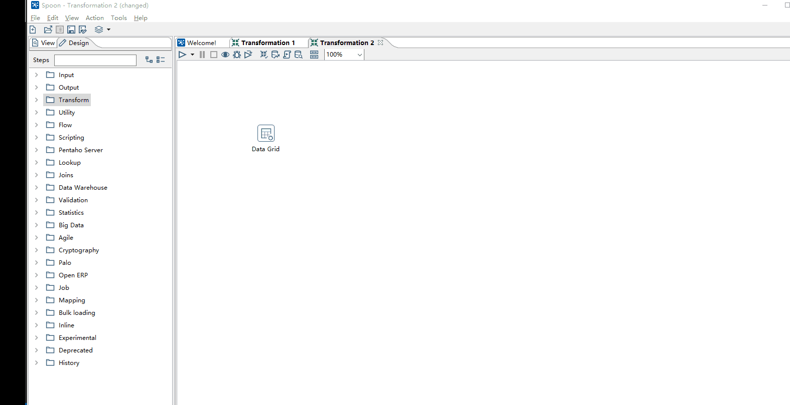
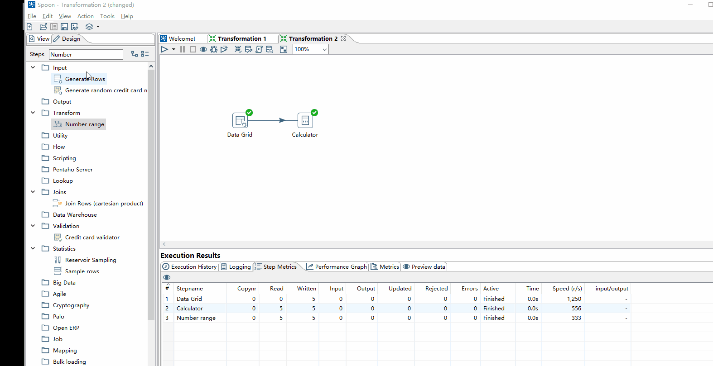
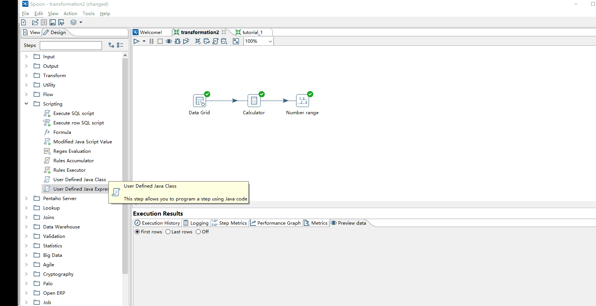

本篇将进行详细的说明Transformation的操作，涉及各方面。但不要纠结使用各种Step，这里只是作为解释数据流、预览、调试方法、熟悉各操作界面。
在本例中将构造一个时间计算的例子进行说明，模拟一家公司的员工的上班的打卡记录，并通过和上班时间对比进行绩效的判定。

## 构造时间计算的Transformation

* 使用Data Grid构建时间数据用于测试： Design --> Input -- > Data Grid .
  
  将鼠标悬停在Data Grid上，就会有Step的说明 ： 输入静态的行数据，用于数据的测试、引用或demo 。

* 在Data Grid中构建数据 ： 左键双击或右键点击选Edit；在元数据(Meta)标签下输入列名类型和格式，在数据(Data)标签下输入数据。

  数据的原型为： 员工编号 、 打卡时间  、 上班时间  ；并向其中插入3条数据 。

* 创建Calculate，用于计算员工是否有迟到:  Design --> Transform -- > Calculator

将鼠标悬停在Calculator上查看其说明： 通过简单的计算，创建新的列，新列的类型为 **整型**

* 通过Hop将Data Grid和Calculator连接，并在Calculator中用work_in - clock_in，以分钟计算。

* 使用Number Ranger对计算打卡时间差评定绩效：如果不确定 Number Ranger在哪个标签下，可以在Steps搜索框中进行搜索

评定的标准为:  提前10分钟到为优 ； 提前10分钟以内为良 ； 迟到大于10分钟为差 

* 通过Hop将Calculator和Number ranger连接

* 最后用User Defined Java Expression整合信息
  
  对于User Defined Java Expression是使用**Janino**作为编译器，实现**动态**的编译Java代码。
  使用Java代码功能添加两列：一列使用3目运算符，输出打卡情况；另一列简单的字符串拼接

构造的例子后，在这个例子的基础上开始说明各部分的内容。

## 流的概念

Input列和Output列,构成输入流和输出流。

## 调试方法 

## Step的配置界面