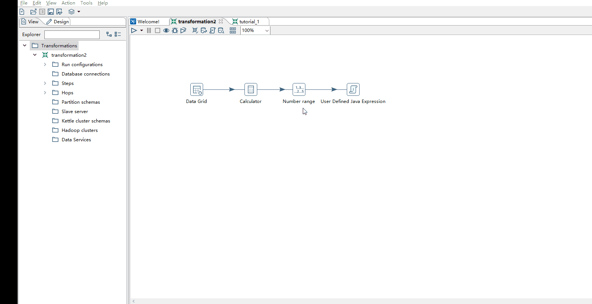
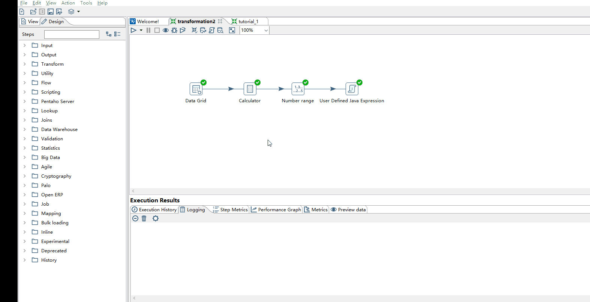
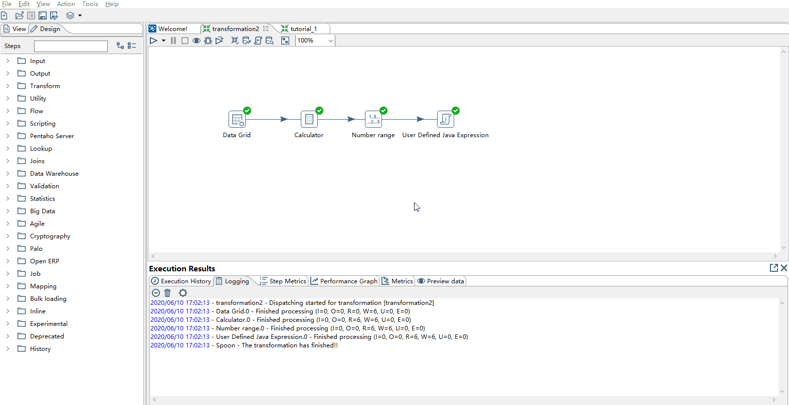
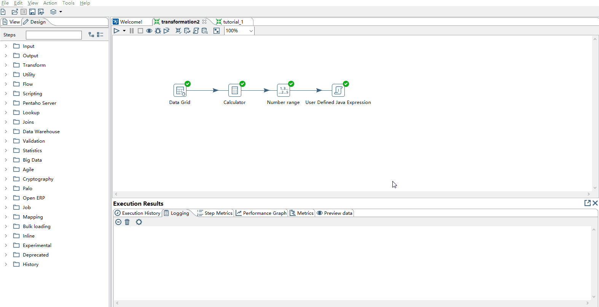
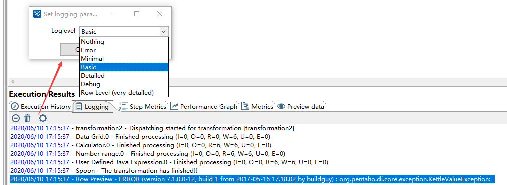
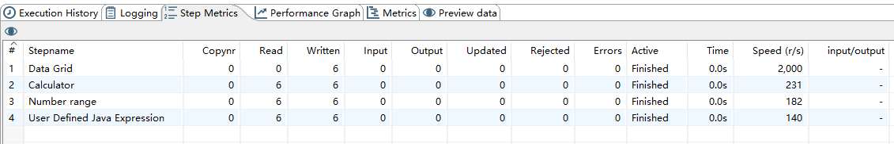
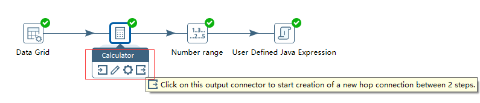
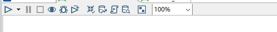
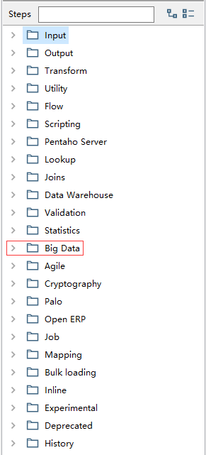

本篇将进行详细的说明Transformation的操作，涉及各方面。但不要纠结使用各种Step，这里只是作为解释数据流、预览、调试方法、熟悉各操作界面。
而在后续的说明将会涉及到具体的数据库、不同的文件格式的操作。
在本例中将构造一个时间计算的例子进行说明，模拟公司的员工的上班的打卡记录，并通过和上班时间对比进行绩效的判定。

## 构造时间计算的Transformation

* 使用Data Grid构建时间数据用于测试： Design --> Input -- > Data Grid .
  
  将鼠标悬停在Data Grid上，就会有Step的说明 ： 输入静态的行数据，用于数据的测试、引用或demo 。

* 在Data Grid中构建数据 ： 左键双击或右键点击选Edit；在元数据(Meta)标签下输入列名类型和格式，在数据(Data)标签下输入数据。

  数据的原型为： 员工编号 、 打卡时间  、 上班时间  ；并向其中插入3条数据 。

* 创建Calculate，用于计算员工是否有迟到:  Design --> Transform -- > Calculator

将鼠标悬停在Calculator上查看其说明： 通过简单的计算，创建新的列，新列的类型为 **整型**

* 通过Hop将Data Grid和Calculator连接，并在Calculator中用work_in - clock_in，以分钟计算。

* 使用Number Ranger对计算打卡时间差评定绩效：如果不确定 Number Ranger在哪个标签下，可以在Steps搜索框中进行搜索

评定的标准为:  提前10分钟到为优 ； 提前10分钟以内为良 ； 迟到大于10分钟为差 

* 通过Hop将Calculator和Number ranger连接

* 最后用User Defined Java Expression整合信息
  
  对于User Defined Java Expression是使用**Janino**作为编译器，实现**动态**的编译Java代码。
  使用Java代码功能添加两列：一列使用3目运算符，输出打卡情况；另一列简单的字符串拼接

构造的例子后，在这个例子的基础上开始说明各部分的内容。

## 流的概念

Input列和Output列,构成输入流和输出流。通过Input和Output是两个Step间的直接联系,可以将Input和Output看具体数据流的具体细节。
查看每个Step的Input和Output的方法，右键单击Step，在出现的界面中选择 Input Fields或Output Fields,然后就能看到对应这个Step的输入列和输出列。

可以发现通过Input和Output可以对数据进行溯源和过滤列。

## 调试方法 

* 在第一步Data Grid中在日期数据中输入字符串，看执行过程中是否发生错误。

具体的错误的信息,由于类型不匹配，无法将字符串转换为时间类型。将对应的类型修正后即可。
~~~
2020/06/10 16:51:18 - Data Grid.0 - ERROR (version 7.1.0.0-12, build 1 from 2017-05-16 17.18.02 by buildguy) : Unexpected error
2020/06/10 16:51:18 - Data Grid.0 - ERROR (version 7.1.0.0-12, build 1 from 2017-05-16 17.18.02 by buildguy) : org.pentaho.di.core.exception.KettleValueException: 
2020/06/10 16:51:18 - Data Grid.0 - work_in String : couldn't convert string [qazwsx] to a date using format [yyyy-MM-dd HH:mm:ss] on offset location 0
2020/06/10 16:51:18 - Data Grid.0 - qazwsx
.......
~~~

* 对Calculator中输入为在data grid中出现的列名，看执行过程是否发生何种错误。

具体的错误信息如下，由于在找到对应的列
~~~
2020/06/10 17:06:58 - Calculator.0 - ERROR (version 7.1.0.0-12, build 1 from 2017-05-16 17.18.02 by buildguy) : Unexpected error
2020/06/10 17:06:58 - Calculator.0 - ERROR (version 7.1.0.0-12, build 1 from 2017-05-16 17.18.02 by buildguy) : org.pentaho.di.core.exception.KettleStepException: 
2020/06/10 17:06:58 - Calculator.0 - Unable to find the second argument field 'clock_diff for calculation #1
2020/06/10 17:06:58 - Calculator.0 - 
......
~~~

* 对User Defined Java Expression中的列不指定类型,看执行过程是否会发生错误。

具体的错误信息如下，未指定相关的类型
~~~
2020/06/10 17:15:37 - Row Preview - ERROR (version 7.1.0.0-12, build 1 from 2017-05-16 17.18.02 by buildguy) : org.pentaho.di.core.exception.KettleValueException: 
2020/06/10 17:15:37 - Row Preview - 打卡情况 None : Unknown type 0 specified.
.......
~~~

通过上面的构造的3个错误，可以在Execution Results窗口中进行查看执行结果和相关信息。Execution Results窗口被分为6个标签，分别对应的功能如下。

* Execution History : 记录了详细的历史执行情况。
* logging           ：记录查看执行的日志，默认情况下日志详细信息的级别是基本日志，但可以选择日志级别。

* Step Metrics      ：显示了transformaton的每个步骤所执行的操作数、状态、信息

|标签列|说明|
|------|--------|
|Read|包含来自前面步骤的行数|
|write|包含从这个步骤到下一个步骤剩下的行数|
|Input|从文件或表中读取的行数|
|Output|写入文件或表的行数|
|Error|执行中出现的错误。如果有错误，整个行将变成红色|
|Active|给出执行的当前状态|

* performance Graph : 执行性能图,可为优化提供信息依据。
* Metrics           : 执行步骤信息
* Preview Data      : 预览数据

## Step的配置界面

* Step辅助窗口

将鼠标在Step上悬停后，将出现辅助窗口，相关的说明如下图所示。

最边上的两个    ：用于连接两个Step间的Hop。
从左到右的第二个：用于对Step进行编辑，对数据处理中的行为的配置。
从左到有的第三个：Step的功能菜单，通过这里对Step各方面的修改和查看。

* 执行调试工具栏

通过执行调试工具栏,进行对Transformation进行调试，验证，预览等操作。

其中将预览也可以视为是调试的一种方式。

* Design中的结构

在Design窗口中，可以发现不同的功能的Step分组存放在不同的目录下。逐渐熟悉，灵活运用。

