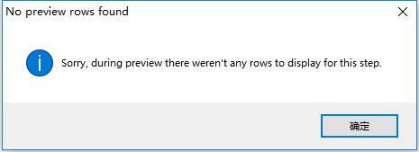
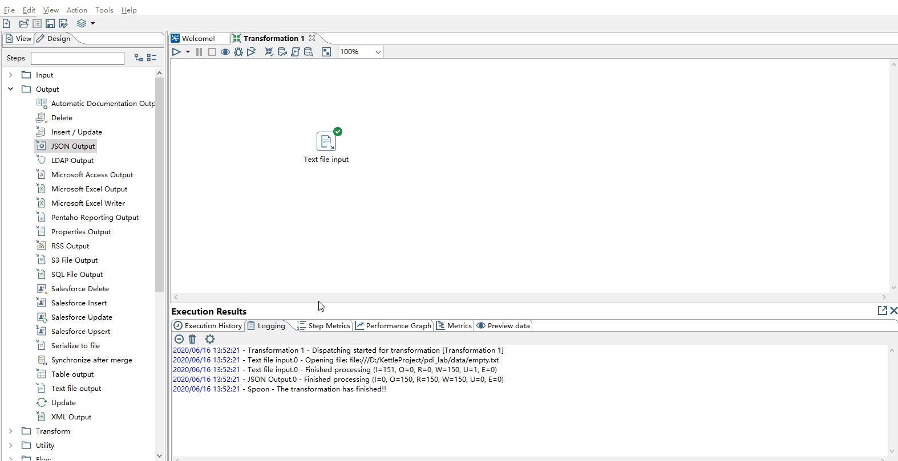
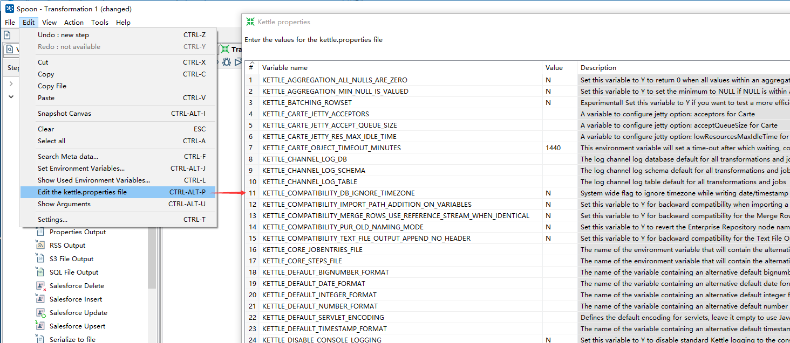

数据无处不在，文件作为一个总要的数据载体，是最常用的数据存储格式。但广泛使用以多种方式存在，如fixed宽度、逗号分隔值、电子表格，甚至自由格式。PDI具有从各种实体读取数据的能力。

## 读取文件实例

在Design窗口中：右键Transformation --> New ，这样的方式创建新的Transformation

在Input分类中 ：选择Text File Input --> File 标签中输入要使用文件的路径（也可以通过浏览查找） -->  点击Add添加。
            
在Content标签下配置： 设置Separator为 --> 勾选Header，表示使用表头

在Fields标签下配置字段： 点击 Get Fileds 自动匹配列

### 从上面的操作中，可以发现：

1 在Input分组中，有针对绝大多数的文件文件数据源的Step。

2 使用Text File Input中的注意的配置点有：
    File标签    ：定义数据源文件,可以是文件夹、文件
    Content标签 ：对文件格式，是否使用分隔符、编码格式、是否使用标题行等。
    Fields标签  ：通过Get Fileds按钮，获取字段信息

在操作练习中，尽量尝试不同格式的文件，使用不同类型的 文件Step。

### 对于文件操作中一些常见的问题：

1 最显而易见的，无法找到相关的文件或文件夹的情形。
  将前面操作的实例说明，将在Text File Input配置的文件名修改，然后在预览数据将出现如下的错误提示。

~~~
No preview rows found
Sorry, during preview there weren't any rows to display for this step.
~~~

2 文件存在，但是文件中内容为空。
 将前面操作的实例进行说明，在Text File Input配置的文件的内容删除，或配置一个空文件。预览数据出现和无法找到文件相同的错误。

3 文件的Content和Filed不匹配，将前面操作的实例中的Content标签下的Seperator字段改为','然后预览数据时间出现如下的错误。

~~~
2020/06/16 10:54:41 - Text file input.0 - ERROR (version 7.1.0.0-12, build 1 from 2017-05-16 17.18.02 by buildguy) : Unexpected error
2020/06/16 10:54:41 - Text file input.0 - ERROR (version 7.1.0.0-12, build 1 from 2017-05-16 17.18.02 by buildguy) : org.pentaho.di.core.exception.KettleException: 
2020/06/16 10:54:41 - Text file input.0 - Error converting line
2020/06/16 10:54:41 - Text file input.0 - 
2020/06/16 10:54:41 - Text file input.0 - Couldn't parse field [Number(3, 1)] with value [5.1,3.5,1.4,0.2,setosa], format [#.#] on data row [1].
2020/06/16 10:54:41 - Text file input.0 - 
2020/06/16 10:54:41 - Text file input.0 - Unexpected conversion error while converting value [sepal_length String(3)] to a Number
2020/06/16 10:54:41 - Text file input.0 - 
2020/06/16 10:54:41 - Text file input.0 - sepal_length String(3) : couldn't convert String to number 
2020/06/16 10:54:41 - Text file input.0 - 
2020/06/16 10:54:41 - Text file input.0 - sepal_length String(3) : couldn't convert String to number : non-numeric character found at position 4 for value [5.1,3.5,1.4,0.2,setosa]
~~~

4  文本内容格式和配置的Filed字段类型不匹配，如对文件中的为String类型，但在Text Input File中配置为Number类型。
   在预览时，将会在出现无法完成类型时就停止，所以只能看到一部分的数据，错误的信息如下：
~~~
2020/06/16 11:37:13 - Text file input.0 - ERROR (version 7.1.0.0-12, build 1 from 2017-05-16 17.18.02 by buildguy) : Unexpected error
2020/06/16 11:37:13 - Text file input.0 - ERROR (version 7.1.0.0-12, build 1 from 2017-05-16 17.18.02 by buildguy) : org.pentaho.di.core.exception.KettleException: 
2020/06/16 11:37:13 - Text file input.0 - Error converting line
2020/06/16 11:37:13 - Text file input.0 - 
2020/06/16 11:37:13 - Text file input.0 - Couldn't parse field [Number(3)] with value [a], format [] on data row [20].
2020/06/16 11:37:13 - Text file input.0 - 
2020/06/16 11:37:13 - Text file input.0 - Unexpected conversion error while converting value [sepal_length String(3)] to a Number
2020/06/16 11:37:13 - Text file input.0 - 
2020/06/16 11:37:13 - Text file input.0 - sepal_length String(3) : couldn't convert String to number 
~~~

## 将数据写回到文件

前面的例子主要演示如何从文件中读取数据和进行配置，在经过一些转换后的数据。可以存放会文件中，所以接下里将演示将csv文件内容
写入到json文件中。

* output分组  ： 选择Json Output , 并和前面的Text File Input通过Hop连接。
* General标签 ： 存储的位置、写入的方式、编码方式等。
* Fields标签  ： 点击Get Fields，配置列名到Json元素的关系。

写入到Json后的数据演示如下。
~~~json
{"data":[{"sepal_width":3.5,"species":"setosa","petal_width":0.2,"sepal_length":5.1,"petal_length":1.4}]}{"data":[{"sepal_width":3.0,"species":"setosa","petal_width":0.2,"sepal_length":4.9,"petal_length":1.4}]}{"data":[{"sepal_width":3.2,"species":"setosa","petal_width":0.2,"sepal_length":4.7,"petal_length":1.3}]}{"data":[{"sepal_width":3.1,"species":"setosa","petal_width":0.2,"sepal_length":4.6,"petal_length":1.5}]}{"data":[{"sepal_width":3.6,"species":"setosa","petal_width":0.2,"sepal_length":5.0,"petal_length":1.4}]}{"data":[{"sepal_width":3.9,"species":"setosa","petal_width":0.4,"sepal_length":5.4,"petal_length":1.7}]}
....
~~~

## Kettle的参数

在Kettle中有 variable 、argument 、parameter供使用。

* variable(变量)

variables可以叫做environment variables,用来设定环境变量的,可以把它认为是编程语言里面的全局变量。变量可以用在转换或作业中，可以通过在转换中使用Set Variable步骤定义或在kettle.properties文件中定义,对于kettle.properties文件可以通过： Edit --> Edit the ketle.properties file

