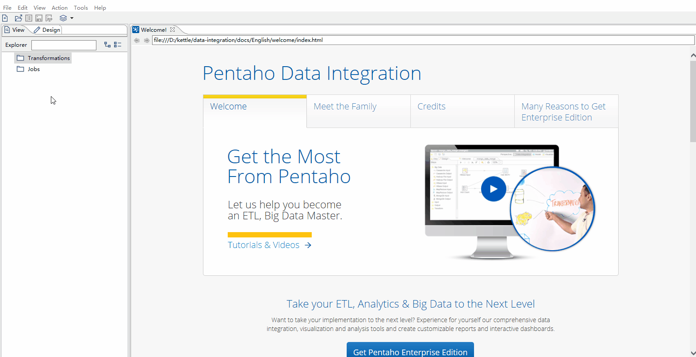
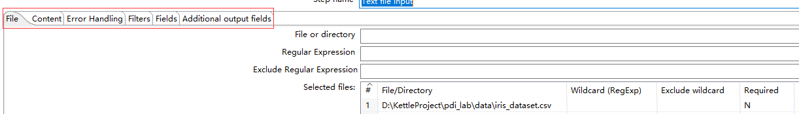

数据无处不在，文件作为一个总要的数据载体，是最常用的数据存储格式。但广泛使用以多种方式存在，如fixed宽度、逗号分隔值、电子表格，甚至自由格式。PDI具有从各种实体读取数据的能力。

## 读取文件实例

在Design窗口中：右键Transformation --> New ，这样的方式创建新的Transformation

在Input分类中 ：选择Text File Input --> File 标签中输入要使用文件的路径（也可以通过浏览查找） -->  点击Add添加。
            
在Content标签下配置： 设置Separator为 --> 勾选Header，表示使用表头

在Fields标签下配置字段： 点击 Get Fileds 自动匹配列

l

从上面的操作中，可以发现：

1 在Input分组中，有针对绝大多数的文件文件数据源的Step。

2 使用Text File Input中的注意的配置点有：
    File标签    ：定义数据源文件
    Content标签 ：对文件格式，是否使用分隔符、编码格式、是否使用标题行等。
    Fields标签  ：通过Get Fileds按钮，获取字段信息

在操作练习中，尽量尝试不同格式的文件，使用不同类型的 文件Step。

3 

