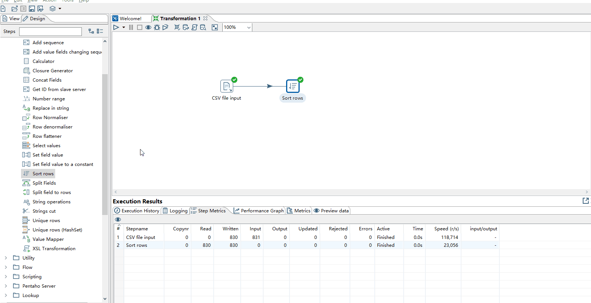
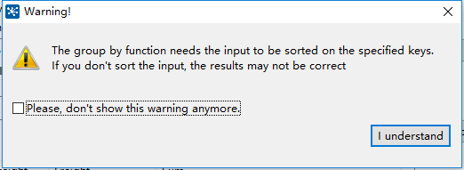
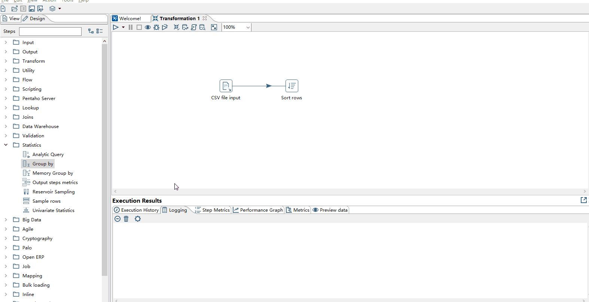
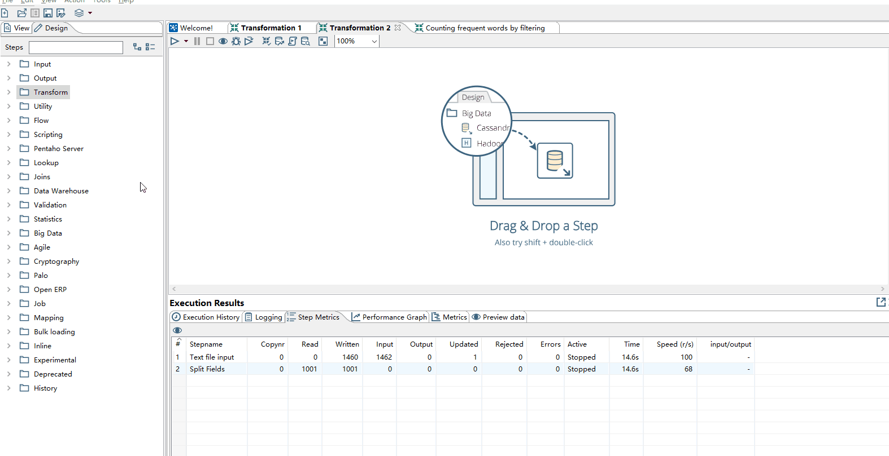
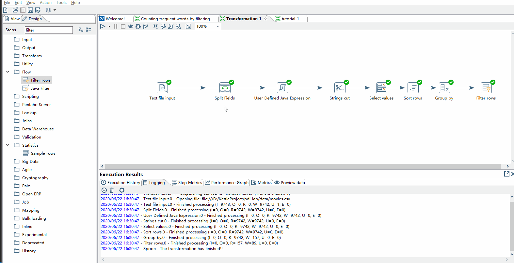

在本小节中，通过Kettle对数据进行汇总、过滤、查询等操作。完成对数据多样化的操作，在实际ETL中简化操作。

## 排序操作

通过读取Northwind数据库中的Orders.csv文件，对订购时间进行排序。对于Orders.csv是在书本：Python大数据分析从入门到精通 中使用的数据，
[下载地址https://github.com/LYJ-NEO/python_practice_stepbystep](https://github.com/LYJ-NEO/python_practice_stepbystep/tree/master/python-on-bigdata/data/northwind)

* 创建一个Transformation 
* Input分组: 选择 CSV Input --> 设置Orders.csv文件路径 --> 设置文件编码 --> Get Fields获取列名 --> Preview查看数据
* Transform分组 ：选择 Sort Rows --> 通过Hop连接 CSV Input到Sort Rows --> 选择要排序的列，并设置升降序 
 
* Transform分组 ：选择 Select Values --> 通过Hop连接 Sort Rows和Select Value --> 为了便于观察数据，选择需要的少许列。
 通过得到的排序数据：客户发现订单下的最早，但运输达到最迟的排序

## 汇总操作

使用OrderDetails.csv文件操作，对订单编号进行汇总，计算运行的货品数，价格平均值，数量汇总等。但在处理前，先提醒由于汇总的列要经过排序,否则数据可能不准确。

* 首先调整前面的例子，对Sort Rows的排序列改为OrderID
* Statistics分组： 选择Group By --> 通过Hop连接 Sort Rows和 Group by
* Group by配置  ： Group filed 选择OrderID --> Aggregates 统计数量和汇总重量。

## 过滤操作

读取MovieLens中的movies.csv数据,对于movies.csv在书本：Python大数据分析从入门到精通 中使用的数据，
[下载地址https://github.com/LYJ-NEO/python_practice_stepbystep](https://github.com/LYJ-NEO/python_practice_stepbystep/tree/master/python-on-bigdata/data/)
将数据中的tilte中时间拆分出为新列，然后根据时间进行过滤。

* 创建一个Transformation : 从Input分组 --> 选择Text File Input --> 选择movies.csv文件 --> 配置相关属性 
* Tranform分组 ： 选择Split Fields --> 尝试通过特定符号分割出 电影的出版年份 
但是发现并不适用，用于有些电影名中含有括号，有些发行年份无法解析出，需要在拆分出一列

在多拆分出一列的方式，然后新拆分的是否有值进行选择，操作的步骤如下：

* scripting分组 --> 选择 user defined java expression --> 通过Hop和前面的Splits Fileds连接
* 对user defined java expression中输入表达式：(other == null)?year:other 
* Transform分组 --> 选择 String Cut --> 对经过user defined java expression处理的列，选择长度为4位
* Transform分组 --> 选择 Select Values --> 选择需要的3列：movieid、title、movie_year
* Statistics分组 --> 选择Group By --> 对movie_year进行分组计数。
* Flow分组 --> 选择Filter rows --> 筛选 cnt > 5 并且 movie_year 不为空的。  

可以发现费力好大劲过滤数据，其中的原因为了充分的演示各种不同的分组下的Step，让读者对这些分组及其下面的Step理解，灵活的处理各种不同的场景数据。
并且在后续的说明中，也会尽量这样的处理。

## 查找
