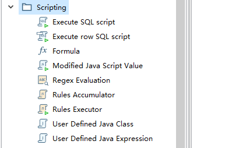
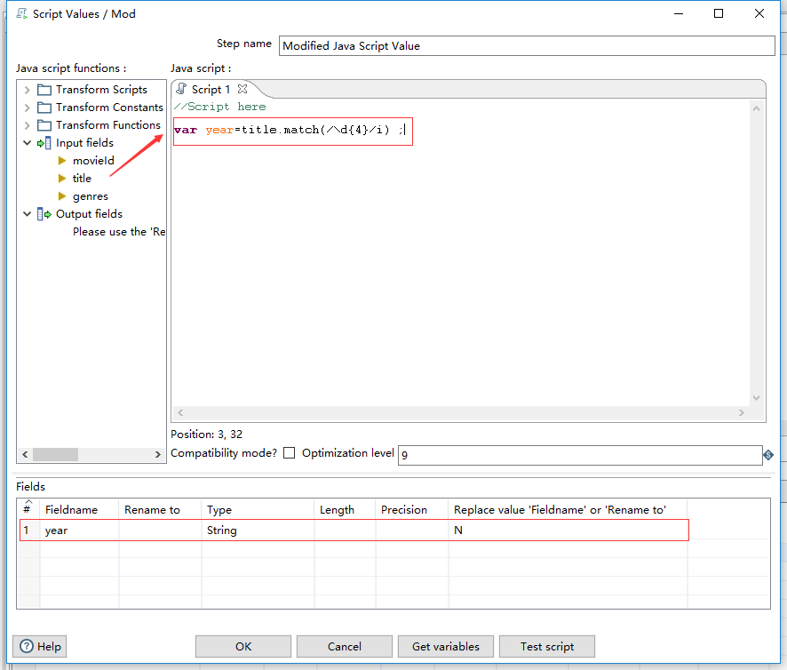
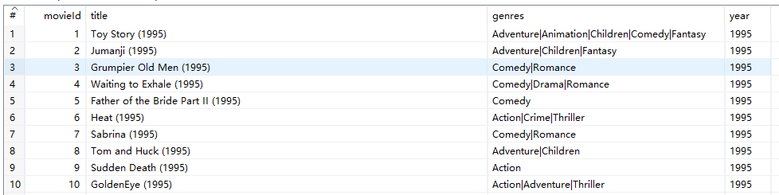
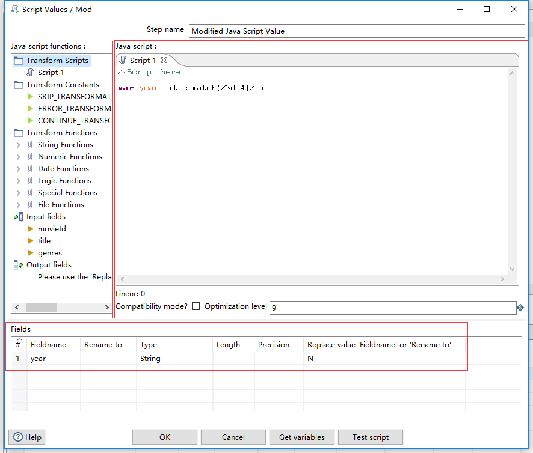

虽然Kettle提供各种功能的Step，但是还是有可能无法处理场景。所以在Kettle中提供各种脚本Step，用来处理数据。
如下所示，在Scripting分组下显示可以使用的脚本，在Experimental分组下的Script Step。

接下来，将对这些脚本的使用进行演示。让读者了解，借助脚本的强大的应变性完成各种需求。

## JS脚本

	这里对前面Movies.csv提取电影年份的操作进行改进。由于原来的操作还是有部分的无法解析出，所以使用JS正则表达式提取出。
操作的步骤如下：

* 在"4-汇总、过滤、查询等操作"小节中说明的操作的基础上，添加一个分流操作;或重新开始一个Transformation
* Scripting分组：选择JavaScript Step -->  Input Fileds 选择title --> 使用JS正则表达式:year=str.match(/\d{4}/i)
* 对FileNmae中选择year进行配置,如下所示。

输出的数据如下所

### JS脚本Step的操作界面说明
	
* 如下图所示，在左侧的Java Scripts Functions下的分组功能：
	
|功能|说明|
|-----|-------|
|Transform Scripts|当前的使用Js脚本情况|
|Transform Constants|预先定义的变量，通过这些变量能改变trans_Status的值|
|Transform Functions|提供的丰富的功能函数，诸如字符串、数字、日期、逻辑操作|
|Input fields|包含上游传递过来的列|
|Oupt fields|通过下方的Fileds标签进行配置|

|Transform Constants|说明|
|-----|-------|
|SKIP_TRANSFORMATION|移除正在处理的数据|
|CONTINUE_TRANSFORMATION|跳过，什么都不做|
|ERROR_TRANSFORMATION|抛出转换失败|

	
* 中间空白是JS代码的编辑区，在这里输入代码，将对传入的每行数据进行操作。

* 最下方的Fields用来定义输出的列。
	

## Java脚本

和Js一样，可以通过向Kettle的装换中插入Java代码。展开Code Snippits --> 打开Common use --> 双击Main。
在Processor标签下的编辑区，将会出现如下代码时最基本的操作，对于一些普遍的功能可以在Snippits下查找。

~~~java
public boolean processRow(StepMetaInterface smi, StepDataInterface sdi) throws KettleException {
  if (first) {        # 针对第一行数据的处理
    first = false;

    /* TODO: Your code here. (Using info fields)

    FieldHelper infoField = get(Fields.Info, "info_field_name");

    RowSet infoStream = findInfoRowSet("info_stream_tag");

    Object[] infoRow = null;

    int infoRowCount = 0;

    // Read all rows from info step before calling getRow() method, which returns first row from any
    // input rowset. As rowMeta for info and input steps varies getRow() can lead to errors.
    while((infoRow = getRowFrom(infoStream)) != null){

      // do something with info data
      infoRowCount++;
    }
    */
  }

  # 函数getRow，用于读取所有的上游数据
  Object[] r = getRow();

  if (r == null) {		# 没有数据需要处理的情况
    setOutputDone();
    return false;
  }

  // It is always safest to call createOutputRow() to ensure that your output row's Object[] is large
  // enough to handle any new fields you are creating in this step.
  r = createOutputRow(r, data.outputRowMeta.size());

  /* TODO: Your code here. (See Sample)

  // Get the value from an input field
  String foobar = get(Fields.In, "a_fieldname").getString(r);      # get(Fields.In, "a_fieldname")使用get函数获取列对象

  foobar += "bar";Snippits Category
    
  // Set a value in a new output field
  get(Fields.Out, "output_fieldname").setValue(r, foobar);         # 通过setValue函数，对列赋值

  */
  // Send the row on to the next step.
  putRow(data.outputRowMeta, r);             # 将处理的数据传递给下游

  return true;
}
~~~

## SQL脚本

	在讲解数据库操作的时候，在详细的说明。