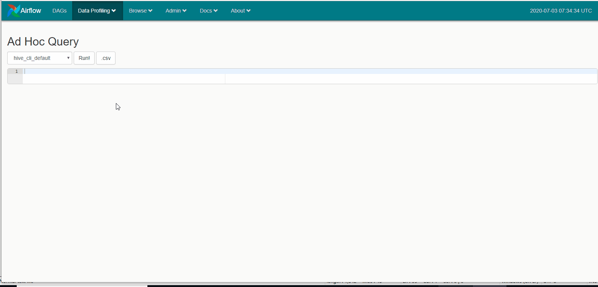

通过 **airflow webserver -p 端口** 成功开启了Airflow Web后，便可进行查看各任务的配置信息、调用执行、监控
运行等。接下来将对Airflow Web各主要功能进行详细的说明，之后在编写Python脚本调用时，能够轻松的执行和监控。
如下图所示，Airflow Web主要分为5个功能，分别是DAGS、Data Profiling、Browser、Admin、Docs。接下来对各项进行详细说明。

### DAGS

在DAGS下，以列表格式展示了所有的DAG。列表中展示各个DAG的 ID、调度周期、执行情况以及对各种链接项。

|DAG列表项|说明|
|---------|-----------|
|开关 列|如上图的说明的第二项:on/off表示对应的DAG是处于活动或暂停状态，只有on状态下才能被调用|
|DAG列|第三列，在对应Python脚本中，定义的DAG_ID|
|Schedulel列|第四列，是对应Python脚本中，设置的执行周期（schedule_interval）。对应的周期信息和crontab格式兼容|
|Owner列|对应Python脚本中，设置的Owner|
|Recent Tasks列|用于显示DAG的任务的近期执行情况，表示状态有：成功、失败、跳过、排队等|
|Last Run列|最后执行的时间|
|DAG Runs|DAG执行的状态，有3种状态|
|Links|各详细的的信息的链接：包括任务树、Python代码、执行日志等。如果是要手动调用执行，点击一个按钮（trigger dag）|

实际上DAG各列可点击的链接，定向到可能其他4个功能中的的界面中。

### Data profiling

对于Data Profiling的作用是：提供了一个简单的查询接口来编写SQL并快速获得结果，并且提供了一个图表应用程序来可视化数据。

### Browser

通过Browser可以查看各种粒度下的执行情况，在这里查看下Task Instance和Logs

### Admin

在Admin标签下，配置Pools、Connections、变量，创建用户等操作，是一个很重要的功能组。

 

