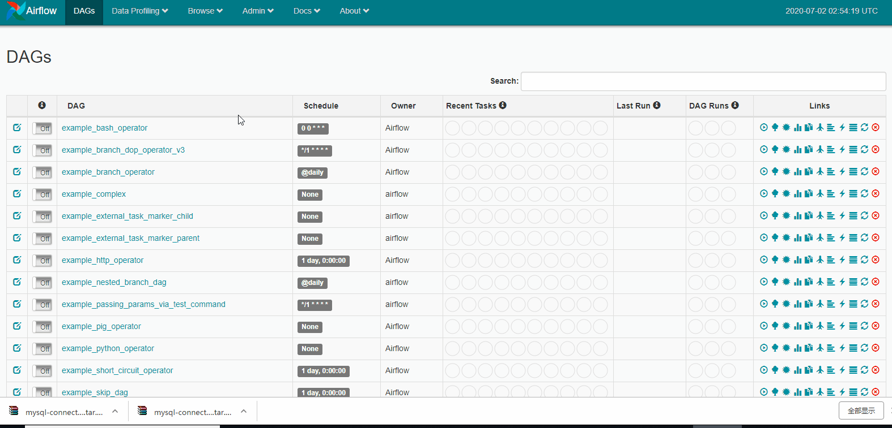
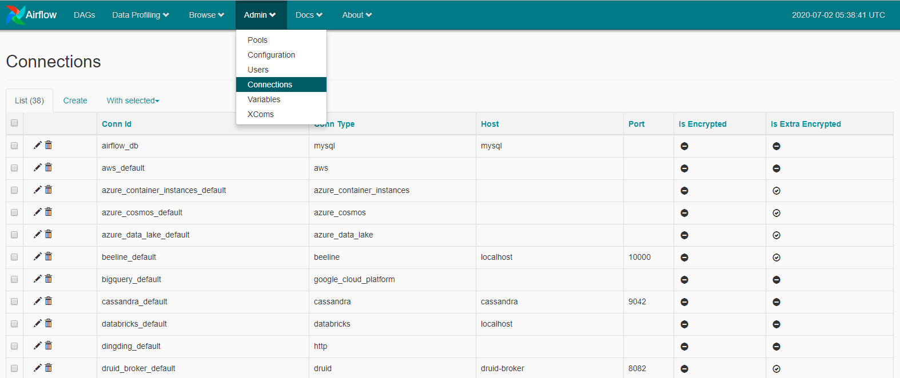
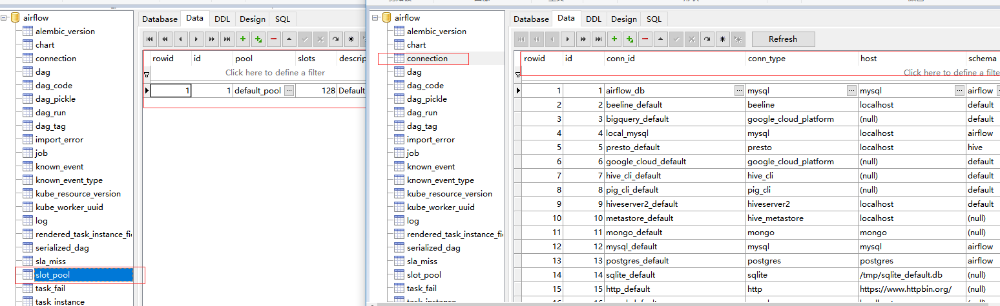

Airflow中的概念对应Python API的类库。结合Airflow的概念介绍小节中，完善概念和功能的扩展。

### Hook技术：

	可以通过Hook技术，对Airflow进行功能上的扩展。让Airflow能够处理更为复杂的任务，诸如限制对资源的同时访问、交叉通信、条件执行等。
对于Hook实际上是外部平台的接口，目前可以对接的外部平台有：Hive、Amazon S3 、Mysql、Postgres、HDFS 、Pig等。Hook尽可能通过以统一的接口方式，
作为operator中的一个构建块。同时通过airflow.models.connection.Connection模块获取主机和授权信息，Hook将授权代码和信息独立于工作流以外，集中
存储在元数据中。
 
### pools：
	在短时间内，系统接收大量处理请求，那么系统会面临崩溃的危险。出于风险避规，在Airflow中引入任务池功能，通过任务池能够限制任务的并行执行个数。
对于任务池可以通过Airflow Web上的 Menu --> Admin --> Pools 进行设置，如下图所示。对于创建的任务池设置一个名字，并设置最大的任务工作数。
在代码中创建Operator的时候，可以绑定一个任务池通过pool参数。

### Connections：
	用于连接外部系统的信息存储在Airflow的元数据中，可以通过Airflow Web上 Menu-->admin-->connections进行查看，如下图所示。
可以发现有一个Connections的列表，其中是已经配置好了对外系统的连接信息。每条连接通过conn_id进行标识，详细的配置信息中包括ip、账号、密码等。
通过指定conn_id,便可进行连接和操作。针对典型的系统，提供了默认的连接，如对postgres数据的conn_id是postgres_default，具体其他信息查看Hooks的说明。

同样的通过数据库中的表信息，也可以查看前面说明的Pools、Connections等信息，通过表slot_pool和connection，如下所示。

### Executor：
	对于Airflow可使用不同的消息队列处理任务，对应的配置信息在airflow.cfg下的[Core]下的executor，相关的值如下所示。
~~~
# The executor class that airflow should use. Choices include
# SequentialExecutor, LocalExecutor, CeleryExecutor, DaskExecutor, KubernetesExecutor
executor = SequentialExecutor
~~~

## 概念和类的映射

### Operator类

将Operator在实例化后，便成为DAG中某种类型的任务类型的节点。在Python API中所有的Operator都是从BaseOperator派生的，并集成了大量的类属性和方法。其中有3个主要Operator类型：

|操作类型|说明|
|-----|------|
|action|Operator执行一个操作，或通知其他系统执行一个操作|
|transfer|在不同的系统间移动数据|
|Sensors|在满足某种条件前将会一直执行（类条件执行作用），举例说明：指定文件被加载到HDFS、Hive中出现分区、一天中的特定时间。Sensors是从BaseSensorOperator继承的，在指定的poke_interval周期上运行一个poke方法，直到它返回True|

|基类|说明|
|-----|------|
|BaseOperator类|所有的Operator都是从BaseOperator派生，并继承了很多功能。由于BaseOperator作为核心，有必要对BaseOperator的参数和属性进行理解。|
|BaseSensorOperator|所有的sensor都是从BaseSensorsOperator派生，对于timeout和poke_interval这些属性也都是继承。|

所有的Operator都封装在以下的包中
airflow.operators
airflow.sensors
airflow.contrib.operators
airflow.contrib.sensors

### Hooks类

	Hook用于扩展Operator的功能，扮演者Operator中的一个构建块。BaseHook是所有Hook的基类，主要的模块有airflow.hooks
airflow.contrib.hooks。
	

