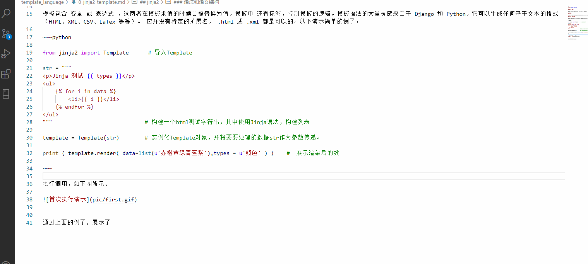

## 何为模板语言

模板语言允许您在模板中定义占位符，这些占位符将根据一组变量或属性详细信息进行个性化设置。现代模板语言不仅支持占位符，还支持循环和条件，这些通常是设计web页面或电子邮件所必需的。

## jinja2

Jinja2是基于python的模板引擎，功能比较类似于于PHP的smarty，J2ee的Freemarker和velocity。 它能完全支持unicode，并具有集成的沙箱执行环境，应用广泛。

### 语法和语义结构

模板包含 变量 或 表达式 ，这两者在模板求值的时候会被替换为值。模板中 还有标签，控制模板的逻辑。模板语法的大量灵感来自于 Django 和 Python。它可以生成任何基于文本的格式（HTML、XML、CSV、LaTex 等等）。 它并没有特定的扩展名， .html 或 .xml 都是可以的。以下演示简单的例子：

~~~python

from jinja2 import Template      # 导入Template

str = """                        

Jinja 测试 {{ types }}

<ul>
    
        <li>{{ i }}</li>
    
</ul>
"""                             # 构建一个html测试字符串，其中使用Jinja语法，构建列表

template = Template(str)        # 实例化Template对象，并将要要处理的数据str作为参数传递。

print ( template.render( data=list(u'赤橙黄绿青蓝紫'),types = u'颜色' ) )    #  展示渲染后的数

~~~

执行调用，如下图所示。

先借助上面的例子，开始说明Jinja2的语法结构：

* 表达式和控制语句

2个最基本语义符号：{{}}  。无法避免的使用

	表达式 通过{{}} 来表示 ： 如上述示例中的 <li>{{i}}</li> 、{{types}}
	
	控制语句  来表示 : 如上述示例中的  ... 
  
* 表达式中的内容的表述方式：

	变量 : 如上述示例中传递的types变量：使用方式就是 {{types}}
	
	任意Python基础类型: 比如字符串{{ "Hello World" }}用引号括起；或者数值、列表、元组、字典、布尔值。
	
	运算 : 算数 {{ 1 + 1 }} 、比较 {{ 1 > 1 }}、逻辑 {{ False and True }}
	
	函数调用: {{ current_time() }} 、数组下标操作 {{ arr[1] }}
	
	in操作符：{{ 1 in [1,2,3] }}
	

* 控制语句
	Jinja2的控制语句主要就是条件控制语句if和循环控制语句for，语法类似于Python。
	
	对于if条件判断的格式如下：第一个和最后一个是必须要有的，中间两行视情况进行使用

~~~html
	    
	...
	
	...
	
	...
	
~~~

	而for语句，在上述的示例代码中已经使用。

~~~html
	
		.....
	
~~~