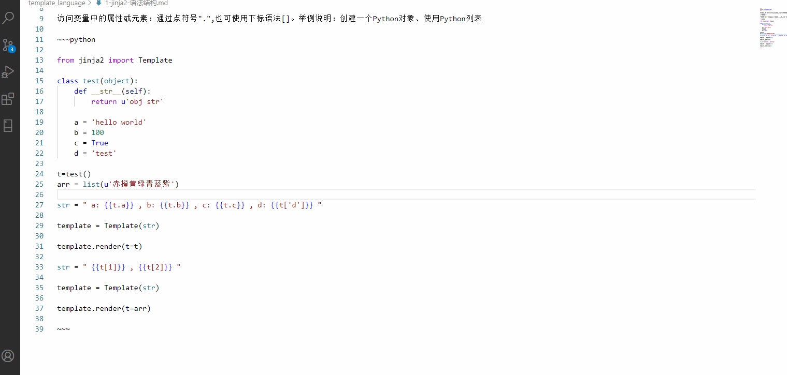
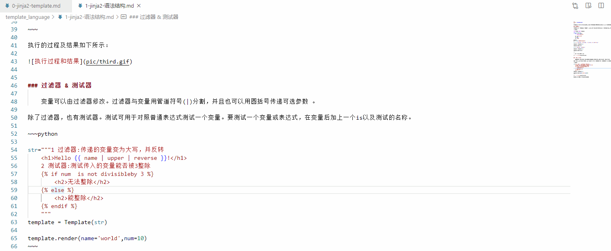

说明了模板语言的作用，演示jinja2的使用方式，并介绍了两个重要的语法结构：{{ }}和。接下来将对jinja2更多的语法进行说明演示。

### 访问变量属性
  
访问变量中的属性或元素：通过点符号".",也可使用下标语法[]。举例说明：创建一个Python对象、使用Python列表

~~~python

from jinja2 import Template   

class test(object):
	def __str__(self):
		return u'obj str'
	
	a = 'hello world'
	b = 100
	c = True
	d = 'test'
	
t=test()
arr = list(u'赤橙黄绿青蓝紫')

str = " a: {{t.a}} , b: {{t.b}} , c: {{t.c}} , d: {{t['d']}} "

template = Template(str)

template.render(t=t)

str = " {{t[1]}} , {{t[2]}} "

template = Template(str)

template.render(t=arr)

~~~

执行的过程及结果如下所示：

### 过滤器&测试器

	变量可以由过滤器修改。过滤器与变量用管道符号(|)分割，并且也可以用圆括号传递可选参数 。

除了过滤器，也有测试器。测试可用于对照普通表达式测试一个变量。要测试一个变量或表达式，在变量后加上一个is以及测试的名称。

~~~python

str="""1 过滤器:传递的变量变为大写，并反转   
    <h1>Hello {{ name | upper | reverse }}!</h1>  
    2 测试器:测试传入的变量能否被3整除 
      
        <h2>无法整除</h2>     
     
        <h2>能整除</h2> 
    

    {# note: disabled template because we no longer use this
    
        ...
    
    #}
    """ 
template = Template(str)

template.render(name='world',num=10)
~~~

还有很多的过滤操作，参考官网说明即可。

### 注释&转义

要把模板中一行的部分注释掉，默认使用{# ... #}注释语法，这在调试或添加给自己或其它模板设计者的信息时是有用的，代码如下所示：

{# note: disabled template because we no longer use this
    
        ...
    
#}

想要Jinja忽略部分，不会把它作为变量或块来处理，使用  .... 


    <ul>
    
        <li>{{ item }}</li>
    
    </ul>


### 行语句&空白控制

**如果应用启用了行语句**，就可以把一个行标记为一个语句。如果行语句前缀配置为# ，下面的两个例子是等价的:

~~~html

<ul>
# for item in seq
    <li>{{ item }}</li>
# endfor
</ul>
=
<ul>

    <li>{{ item }}</li>

</ul>

~~~

默认配置中，模板引擎不会对空白做进一步修改，所以每个空白（空格、制表符、换行符等）都会原封不动返回。如果应用配置了Jinja的trim_blocks ，模板标签后的第一个换行符会被自动移除。
也可以手动剥离模板中的空白,当在块（比如一个for标签、一段注释或变量表达式）的开始或结束放置一个减号(-)，就可移除块前或块后的空白。

~~~html


    {{ item }}


~~~

### 赋值和with语句

赋值：在代码块中，可以为变量赋值。
	
~~~html


~~~

类似于Python中的with关键字，它可以限制with语句块内对象的作用域。

~~~html

    
    {{ foo + bar }}

{# foo and bar are not visible here #}
~~~

### 模板继承

Jinja中最强大的部分就是模板继承。模板继承允许你构建一个包含你站点共同元素的基本模板“骨架”，并定义子模板可以覆盖的块。以下使用官方文档中的例子
说明模板继承的操作

* 基本模板

母模板:把它叫做base.html，定义了一个简单的HTML骨架文档。使用一个简单的两栏页面,用内容填充空的块是子模板的工作。

~~~html

<!DOCTYPE HTML PUBLIC "-//W3C//DTD HTML 4.01//EN">
<html lang="en">
<html xmlns="http://www.w3.org/1999/xhtml">

<head>
    
    <link rel="stylesheet" href="style.css" />
    <title>  - My Webpage</title>
    
</head>

<body>
    


    

        
        &copy; Copyright 2008 by <a href="http://domain.invalid/">you</a>.
        
    

</body>

~~~

在基本模板中使用标签定义了四个可以填充的块,所有的block标签告诉模板引擎子模板可以覆盖模板中的那些部分。

* 子模板

~~~html


Index


    {{ super() }}
    



    <h1>Index</h1>
    

      Welcome on my awesome homepage.
    



~~~

 标签是这里的关键,它告诉模板引擎这个模板"继承"另一个模板。当模板系统对这个模板求值时，首先定位父模板。
如果父模板中的块里有内容不想被子模板替换,使用super()方法。

**块语句的作用域**
默认情况下，块内语句是无法访问块外作用域中的变量。如在”layout.html”加上一个循环，在子模板中定义”list”块并访问循环中的”item”变量。

~~~html

{# 在基本模板中定义的循环 #}

    <li></li>


{# 在子模板中访问基本模板中循环的item变量,但是执行的结果为空 #}

    <em>{{ item }}</em>


{# 在块声明时添加scoped关键字,如下所示 #}

    <li></li>


~~~

~~~python

from jinja2 import Template ,Environment,FileSystemLoader

sub_html="""


Index


    {{ super() }}
    



    <h1>Index</h1>
    

      Welcome on my awesome homepage.
    



"""

env = Environment( loader=FileSystemLoader(searchpath='D:/') )

template = env.get_template(sub_html)

print ( template.render() )

~~~

### html转义

当从模板生成HTML时，始终有这样的风险:变量包含影响已生成HTML的字符。有两种解决方法:手动转义每个字符或默认自动转义所有的东西。
Jinja两者都支持，使用哪个取决于应用的配置,默认的配置未开启自动转义有这样的原因:

* 转义所有非安全值的东西也意味着Jinja转义已知不包含HTML的值，对性能有巨大影响。

* 关于变量安全性的信息是易碎的。可能会发生强制标记一个值为安全或非安全的情况，而返回值会被作为 HTML 转义两次

1 使用手动转义

如果启用了手动转义，按需转义变量就是你的责任。要转义什么？如果有一个可能包含 > 、 < 、 & 或 " 字符的变量，必须转义它，除非变量中的HTML有可信的良好格式。
转义通过用管道传递到过滤器|e来实现:{{ user.username|e }}。

2  使用自动转义

当启用了自动转移默认会转移一切，除非值被显式地标记为安全的。可以在应用中标记，也可以在模板中使用 |safe 过滤器标记。
这种方法的主要问题是Python本身没有被污染的值的概念，所以一个值是否安全的信息会丢失。如果这个信息丢失，会继续转义，你最后会得到一个转义了两次的内容

### 宏

~~~python

from jinja2 import Template  

str="""

    <input type="{{ type }}" name="{{ name }}" value="{{ value|e }}">


{{ input('username', value='user') }}

{{ input('password', 'password') }}

{{ input('submit', 'submit', 'Submit') }}

"""

template = Template(str) 

print ( template.render() )  

~~~